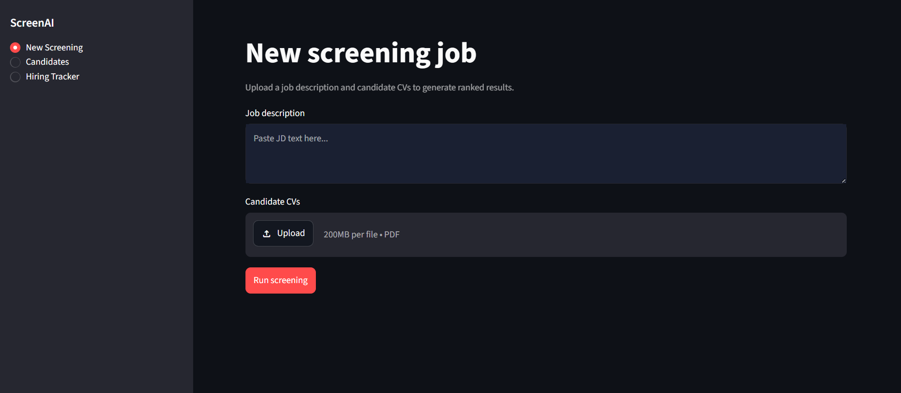
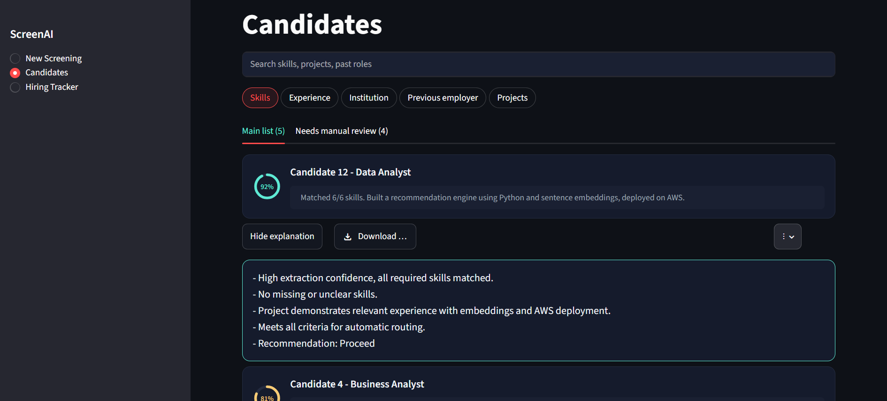
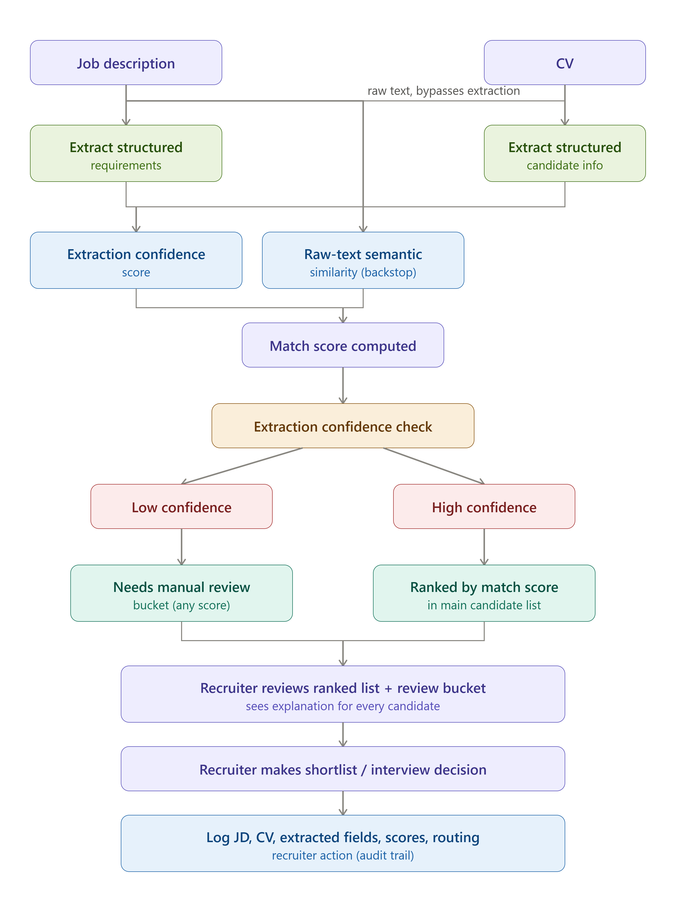
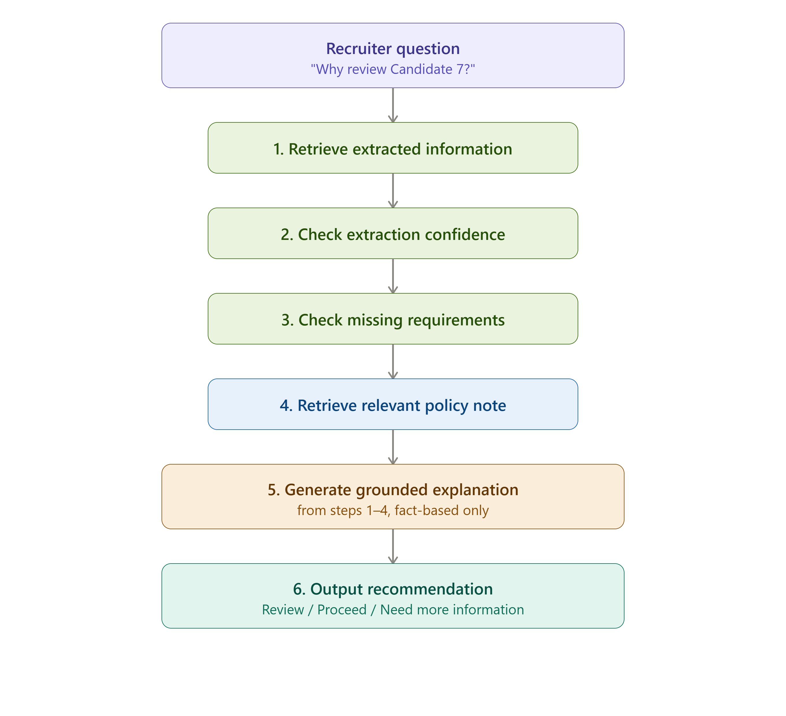

# AI-Assisted Recruitment Decision Support Platform

## What is this?

A tool I built to help a recruiter go through hundreds of job applications faster — without unfairly rejecting good people, and without ever letting the AI make the final call.

## Why I built this

Picture this: a company posts one job opening and gets 500 CVs. Someone has to actually read every single one to figure out who's qualified. That takes days, it's exhausting, and two different recruiters reading the same CV will often judge it differently.

A lot of companies have tried to fix this with automated tools, but those tools quietly created a new problem. They often reject genuinely good candidates just because their CV has an unusual layout — a two-column design, a creative template, anything a bit non-standard — even if the person is perfectly qualified. That's not really about skill anymore, it's about formatting luck.

There's a second, sneakier bias too. Recruiters going through applications as they arrive tend to be more generous with the first few people they read, and more tired and critical by CV number 300 — even if that 300th person is actually the stronger candidate. So *when* you happened to apply can end up mattering more than it should.

I wanted to build something that fixes both of these without just replacing one black box with another.

## What I was actually going for

- **Faster** — a recruiter works from a ranked list instead of reading every CV cold
- **Fairer** — nobody gets quietly rejected for how their CV looks, and applying early or late doesn't change your odds
- **Explainable** — every recommendation comes with an actual reason, not just a mystery percentage
- **Human-controlled** — the AI only ever suggests. A person decides. Always.

## What makes this different from other AI screening tools I've seen

Most "AI hiring" tools work like this: upload CVs, get a score, low scores get auto-rejected, and nobody really knows why. That's fast, but it's a black box, and it can be unfair without anyone ever noticing.

I did two things differently here:

1. **If a CV can't be read cleanly** — bad formatting, a scanned image, an unusual template — it does *not* get scored low and quietly dropped. It gets flagged as "needs a human look," kept clearly separate from candidates who are genuinely a weaker match. Nobody just disappears from the list.
2. **Every recommendation comes with a real explanation.** Not "72% match" and nothing else — you can click a button and see the actual reasoning: which skills matched, what's missing, and why that candidate ended up where they did.

## Why this actually matters

For a company using this in practice: faster shortlisting, fewer strong candidates lost to formatting quirks, and a hiring process you could actually explain if someone asked "why was this person ranked here?" — which matters more than it used to, since regions like the EU now legally expect companies to be able to explain AI-driven hiring decisions, not just point at a score.

## What it looks like

**Uploading a job and a batch of CVs:**



**The ranked list, with a real explanation pulled up for the top candidate:**



## System architecture

**How a CV goes from upload to a ranked, explained recommendation:**



The key design choice is right in the middle: extraction confidence is checked *separately* from match score. A CV that scores low because it genuinely lacks required skills is ranked low. A CV that couldn't be reliably read is never scored at all — it goes straight to manual review, no matter what a rough score might have said.

## Want the full story?

- 📄 [Case Study](./AI-Recruitment-Platform-Case-Study.pdf) — the problem, the design decisions, how it stacks up against existing tools, and what I'd build next
- 📄 [Business Requirements Document](./AI-Recruitment-Platform-BRD.pdf) — the detailed technical requirements, written the way a real one would be at a company

## How it actually works, simply put

1. A recruiter uploads a job description and a batch of CVs
2. The system compares each CV against what the job needs
3. Candidates land in one of two lists — a main ranked list, or a "needs a human look" list if something couldn't be read reliably
4. Clicking a candidate shows a plain-English explanation of their ranking — written by an AI model, but only using facts actually found in their CV, never invented
5. A separate tracker page shows people moving through stages: Shortlisted → Interview → Hired

**What that explanation step actually does under the hood:**



When a recruiter asks "why review this candidate," the system doesn't just ask an AI to guess. It retrieves the actual extracted data, checks confidence, checks what's missing, pulls the relevant policy — and only then generates an explanation, grounded in those specific facts. That's the difference between an AI that explains itself and one that just sounds confident.

## Want to run it yourself?

```bash
pip install -r requirements.txt
```

Grab your own free [Groq](https://console.groq.com) API key, paste it into `app.py` (replacing `PASTE_YOUR_GROQ_API_KEY_HERE`), then:

```bash
streamlit run app.py
```

## Being upfront about what's actually finished

I built this in about 2 days as a portfolio project, so I focused my time deliberately. **Fully working:** the ranking, the two-list system, search, and the AI explanation feature. **Visible on screen but not wired up yet:** a few buttons like "download CV" or "schedule interview" — they show the intended design, but don't do anything yet. I'd rather say that plainly than let the demo oversell itself. Full breakdown is in the Case Study above.

## Built with

Python, Streamlit, and Groq's API (running an open-weight AI model)
